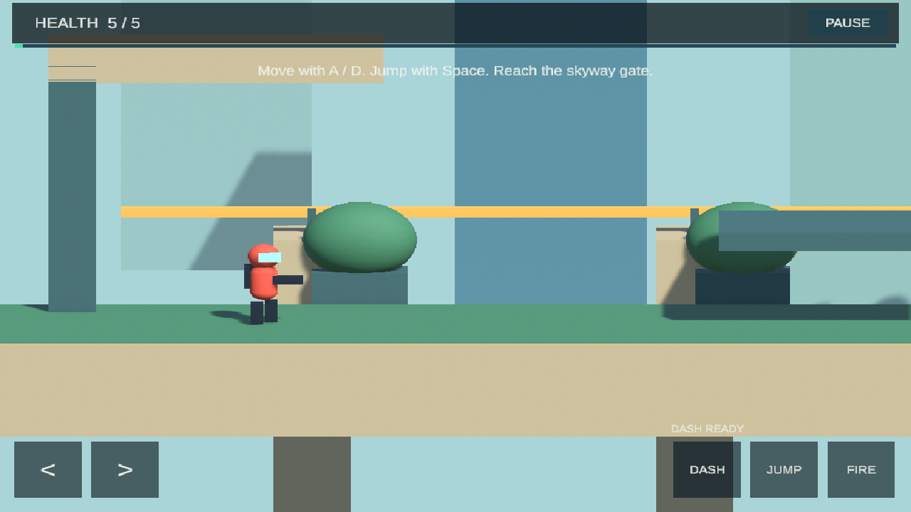

# ContraRun v2 — in development

[Product preview](https://pstarwars2026.github.io/contra-run-v2/) · [Development status](https://pstarwars2026.github.io/contra-run-v2/status.html) · [Support](https://pstarwars2026.github.io/contra-run-v2/support.html) · [Privacy](https://pstarwars2026.github.io/contra-run-v2/privacy.html)

A new 2.5D action adventure planned for iPhone, iPad, and Mac. Run the forgotten skyway, jump between platforms, and time a dash to reflect hostile fire. The private prototype includes an opening level, checkpoint, sentries, and a boss.

**In development. Not yet available on the App Store.** The commercial title, release date, price, and final paid content list are not yet settled. The screenshot shows actual prototype gameplay with unfinished art.

## Planned free and paid gameplay

| Free opening chapter | Full Adventure — planned |
|---|---|
| A complete level and boss | Remaining campaign, still in development |
| Replay without a timer or energy limit | One-time non-consumable purchase |
| Run, jump, fire, and deflect | Shared iPhone/iPad/Mac ownership intended, pending validation |

No purchases are currently available. Final artwork, additional chapters, save progress, real-device testing, and purchase/restore validation remain before release.

## Product repository, private source

This is the public home for product information, support, privacy, and feedback. It contains no v2 game source or downloadable app binaries. V2 is proprietary. The separate [ContraRun v1.3 repository](https://github.com/pstarwars2026/contra-run) remains open source under its existing license.

For feedback, [open an issue](https://github.com/pstarwars2026/contra-run-v2/issues/new/choose). GitHub issues are public; do not include personal information or purchase receipts.

Copyright © 2026 pstarwars2026. Public product information does not grant a license to the proprietary app source. Third-party materials retain their applicable licenses.
